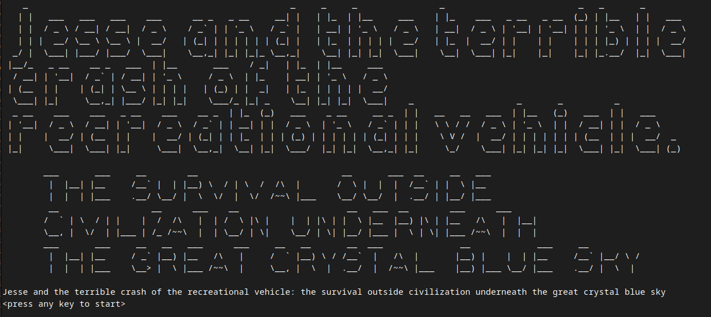
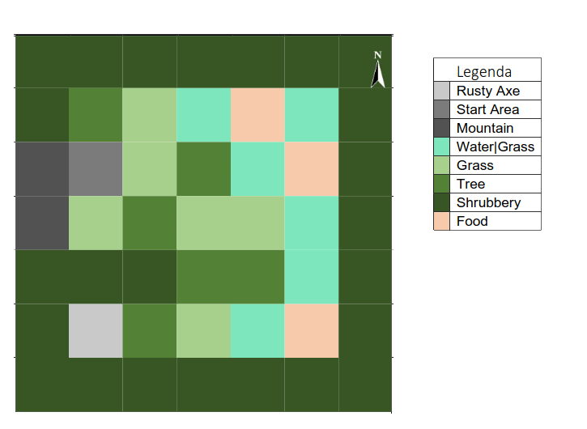

## How to play

first, navigate towards the rusty axe using `go`, take the axe using `take`. Then navigate towards trees and run `use axe` until you've aquired 4 wood. Then create a boat using the `make boat` command and navigate towards a food tile. Take the food using `take` and eat it using `eat`. Finally, navigate back to the mountain.

## Story

Jesse was preparing for a trip to their family but something went terribly wrong. While driving through the mountains Jesse got distracted. Because of this, Jesse crashed into a tree. Luckily Jesse jumped out of the vehicle before the impact, surviving the crash. Although, Jesse didn’t realize that they just jumped off the mountain. Jesse rolled off the relatively steep mountain and was knocked out. Jesse didn’t know how long they were gone but they did know that they were hungry. Because of this, Jesse was unable to climb back up the mountain. Will you help Jesse get food so Jesse can get back to their family?

## Commands

| Command | Argument                      | Action                                                                                                         |
| ------- | ----------------------------- | -------------------------------------------------------------------------------------------------------------- |
| `eat`   |                               | Looks if you have taken the food or are located at a food tile and eats it.                                    |
| `go`    | `north` `east` `south` `west` | Tries to navigate in a curtain direction, this can trigger special actions.                                    |
| `help`  |                               | Gives help for your current context. e.g. when you have an axe you’re told what the use command does.          |
| `look`  |                               | Tells you what type the north, east, south, west tiles are                                                     |
| `make`  | `boat`                        | If you have 4 wood then you make a boat so you can cross water tiles.                                          |
| `take`  |                               | If you are on an axe or food tile you take the item.                                                           |
| `use`   | `axe`                         | If you have the axe and are standing on a tree tile you gain one wood and the tree tile turns to a grass tile. |

## Map

 
*\*Food position is picked at random upon loading the game. The other food tiles will turn to grass & be surrounded by grass. The Picked food tile will be surrounded by water.*

### tile pass conditions

| Tile Type  | Condition     |
| ---------- | ------------- |
| Rusty Axe  | yes           |
| Start Area | yes           |
| Mountain   | when ate food |
| Water      | with boat     |
| Tree       | yes           |
| Shrubbery  | no            |
| Food       | yes           |

## Additional info

- There is a 25% chance that Jesse is distracted by a potoo.
- This "Jesse" has no correlation with the character "Jesse Pinkman" from the drama series Breaking Bad, I don't know what you're talking about. :eyes:
